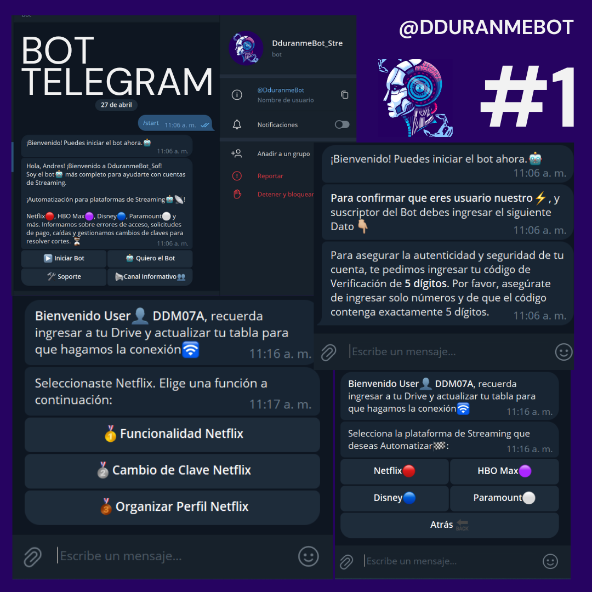
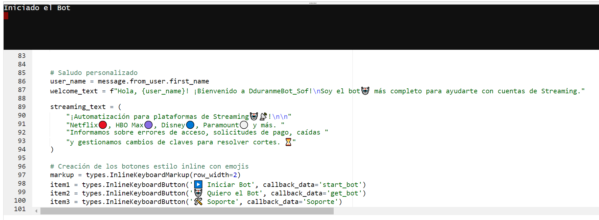

# TelegramBot_Streaming 

El Bot Streaming realiza una minuciosa revisión de cada cuenta como si fuera una interacción humana. Detecta posibles fallas, solicitudes de pago, errores de clave y verifica la existencia de las cuentas. Todo esto, de manera automatizada, ahorrándote tiempo y recursos. 

<h1>
  
</h1>

El bot se encuentra alojado en PythonAnywhere, una plataforma en línea que ofrece entornos de desarrollo y alojamiento web para aplicaciones Python. PythonAnywhere proporciona un entorno seguro y confiable para ejecutar nuestro bot, permitiendo su funcionamiento continuo y acceso desde cualquier lugar con conexión a internet."

